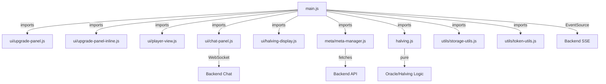

# Code Organization & Modularity Audit

**Date**: 2026-03-25
**Scope**: Frontend JavaScript module structure after the recent refactor wave
**Overall Rating**: GOOD - modular UI/service split with one intentionally large orchestrator

## Current State Summary

The frontend refactor goals from the earlier audit were largely completed.

Completed extractions now in place:

- `src/services/stream-controller.js` for SSE lifecycle and timer cleanup
- `src/services/game-actions.js` for create/join and upgrade requests
- `src/ui/setup-shell.js` for setup-panel state and header navigation
- `src/ui/live-summary.js` for score and portfolio summary rendering
- `src/ui/leaderboard.js` for leaderboard rendering
- `src/ui/season-cards.js` for season-card balance/output/halving updates
- `src/ui/player-view-layout.js` for player analytics matrix/layout construction
- `src/ui/player-view-score.js` for player analytics score resolution/formatting

Current status:

- `src/main.js` remains large at about 1,611 lines, but it is now primarily an orchestration/root wiring module.
- `src/ui/player-view.js` is down to about 392 lines and delegates layout and score helpers.
- High-noise test coverage in `src/main.test.js` has been split into dedicated suites (`src/main.halving.test.js`, `src/main.halving-passthrough.test.js`, `src/main.season-upgrades.test.js`, `src/main.inline-upgrades.test.js`).

---

## 1. Module Distribution Overview

### File Size Snapshot (selected refactor-sensitive modules)

| Module | Approx. Lines | Role | Status |
| --- | ---: | --- | --- |
| `src/main.js` | 1611 | App orchestration/root wiring | Large but intentional |
| `src/main.test.js` | 642 | Core orchestration tests | Reduced and focused |
| `src/ui/player-view.js` | 392 | Analytics render orchestration | Reduced and focused |
| `src/ui/player-view-layout.js` | 286 | Analytics DOM/layout builders | Newly extracted |
| `src/ui/player-view-score.js` | 83 | Analytics score helpers | Newly extracted |
| `src/main.inline-upgrades.test.js` | 487 | Inline upgrade module tests | Newly extracted |
| `src/main.season-upgrades.test.js` | 346 | Season-card/upgrade flow tests | Newly extracted |
| `src/main.halving.test.js` | 256 | Halving behavior tests | Newly extracted |

### Modularity Assessment

#### Strongly modular areas

- `src/ui/` is now split into focused render/state modules instead of concentrating UI behavior in `main.js`.
- `src/services/` owns transport and action flows.
- `src/utils/` stays utility-only.
- `src/meta/` isolates contract/meta concerns.
- `src/config/` is the control-data layer: `game-control-data.js` centralises all game setup tunables (duration presets, scoring defaults, session/enrollment limits) and `trading-control-data.js` holds trade-scheduling constants. All other modules must import from here; no tunable should be duplicated inline.

#### Remaining large area

- `src/main.js` is still above the normal size threshold, but this is currently accepted because it coordinates the app shell, bootstrapping, stream state, setup state, and module wiring.

---

## 2. main.js Assessment

### What main.js still owns

`src/main.js` remains the root entrypoint for:

1. DOM element caching and top-level app state
2. bootstrapping child UI/service modules
3. setup-mode state transitions
4. async/sync round orchestration
5. stream-driven UI update scheduling
6. app-level event listeners and startup flow

### Why it was not split further

The remaining size is mostly orchestration, not hidden business logic duplication.

- Stream transport is already delegated to service modules.
- Season rendering, leaderboard rendering, setup shell, live summary, and analytics are already delegated.
- Further forced extraction would mostly move cross-module coordination into smaller files without reducing conceptual complexity.

Current recommendation:

- Keep `src/main.js` as the orchestration root unless a clearly cohesive new subsystem emerges.
- Prefer future extractions only when they remove a stable concern boundary, not just to reduce line count.

---

## 3. Current High-Value Modules

| Module | Responsibility |
| --- | --- |
| `src/ui/leaderboard.js` | leaderboard rendering |
| `src/ui/season-cards.js` | season-card balance/output/halving updates |
| `src/ui/player-view.js` | analytics render orchestration |
| `src/ui/player-view-layout.js` | analytics table/layout creation and tooltip anchors |
| `src/ui/player-view-score.js` | analytics score display helpers |
| `src/services/stream-controller.js` | SSE stream lifecycle |
| `src/services/game-actions.js` | create/join/upgrade API flows |
| `src/ui/setup-shell.js` | setup panel, top controls, and header navigation |

---

## 4. Current Module Dependencies



**Key Observations**:

- ✅ **Tree structure** - main.js is root (good)
- ✅ **No circular dependencies** - clean acyclic graph
- ✅ **Proper layering** - utils/meta/logic below UI
- ✅ **Limited coupling** - each UI module independent

---

## 5. Testability Assessment

### ✅ Currently Testable

| Module | Tests Exist | Coverage | Quality |
| --- | --- | --- | --- |
| `halving.js` | Yes | Excellent | Pure functions tested |
| `main.js` orchestration | Yes | Good | Split across `main*.test.js` suites |
| `chat-panel.js` | Yes | Good | Event handling tested |
| `upgrade-panel-inline.js` | Yes | Good | Dedicated module tests |
| `player-view.js` | Yes | Good | Direct unit tests in `src/ui/player-view.test.js` |
| `leaderboard.js` | Yes | Good | Dedicated rendering tests |
| `season-cards.js` | Yes | Good | Dedicated rendering tests |

### Remaining test focus areas

1. `src/main.js` still carries the most branch-heavy orchestration paths.
2. Future changes around async round lifecycle should continue to add scenario-specific tests rather than grow `src/main.test.js` monolithically.
3. Tooltip/static parity tests should remain aligned with helper-module extractions (for example `player-view-layout.js`).

---

## 6. Code Quality Metrics

### Cyclomatic Complexity Assessment

**High complexity areas**:

1. **main.js::createNewGameAndJoin()** - 12+ code paths
   - Multiple error conditions, async/await handling
   - Acceptable for complex feature

2. **ui/player-view.js::renderPlayerState()** - Multiple token loops
  - Still justified by multi-token rendering requirement, now supported by extracted layout/score helpers

3. **ui/upgrade-panel.js::renderUpgradeMetrics()** - Complex form building
   - Acceptable for modal structure

**Recommendation**: Current complexity is acceptable given feature requirements.

---

## 7. Naming & Clarity Assessment

### ✅ Excellent Naming Conventions

- `getGameMeta()` - Clear getter
- `resolveNextHalvingTarget()` - Clear algorithm name
- `normalizeBaseUrl()` - Clear intent
- `clearCountdownInterval()` - Clear action
- `renderInlineSeasonUpgrades()` - Descriptive function name
- `renderPlayerState()` - Clear responsibility

### ✅ Comment Quality

**Main.js header** (lines 1-20):

```javascript
/*
Purpose: Browser dashboard client for Mining Tycoon
- Manage SSE lifecycle and reconnect behavior
- Fetch/cache meta contracts with ETag
- Render state/leaderboard/upgrades
*/
```

Well-documented purpose statement.

**Function documentation**:

- Most functions have JSDoc-style comments
- Example: `renderInlineSeasonUpgrades()` has parameter docs

---

## 9. Refactoring Priorities (Optional)

### Priority 1: LOW (Not Required)

- Extract leaderboard rendering if you frequently modify it
- Extract season rendering if planning season-specific features
- Benefit: Better organization, easier testing

### Priority 2: MEDIUM (Nice to Have)

- Add unit tests for player-view DOM rendering
- Benefit: Catch layout bugs earlier

### Priority 3: CRITICAL (Do Not Implement)

- Don't split SSE/connection logic
- Don't over-modularize pure functions
- Keep main.js as orchestration hub

---

## 9. Multi-Page Entrypoints

### Separate Admin & Player Builds

This frontend is built with two entrypoints:

- **`index.html`** — Player-facing dashboard (`dist/index.html`) linked as the main entry in `vite.config.js`
- **`admin.html`** — Admin-only round setup UI (`dist/admin.html`) linked as a secondary entry in `vite.config.js`

Both share the same global stylesheet (`src/style.css`) and may import from shared utility/service modules, but maintain separate DOM structures and control flows.

### Admin Module Location

- **`src/admin/admin-setup.js`** — Admin UI orchestration for round creation, configuration form binding, and API submission (POST /games with optional X-Admin-Token header)
- **`src/admin/admin-setup.test.js`** — Dedicated tests for admin workflow

### Admin Discoverability (Security)

The admin link is intentionally **gated** in the player UI:

- **Player page (`index.html`)** has a hidden `#admin-setup-link` element that is shown **only if the URL query parameter `?admin=1` is present**
- This prevents accidental leakage of admin controls to casual players
- Backend permission enforcement (via X-Admin-Token header and REQUIRE_ADMIN_FOR_GAME_CREATE flag) is the authoritative gate

### Control Data Shared Across Pages

Both pages import from the same control-data layer:

- **`src/config/game-control-data.js`** — Centralized round setup tunables (duration presets, scoring modes, session/enrollment limits)
- **`src/config/trading-control-data.js`** — Centralized trade scheduling constants
- No tunable should be duplicated or hardcoded in UI modules on either entrypoint

---

## 10. Conclusion

### Overall Code Organization Rating: GOOD (8/10)

**Strengths**:

- ✅ Clear separation of concerns (UI ≠ Logic ≠ Utils)
- ✅ Utilities are properly extracted and reusable
- ✅ No circular dependencies
- ✅ Child modules are testable in isolation
- ✅ Good naming conventions throughout
- ✅ Recent player-view and main-test refactors improved cohesion significantly

**Opportunities**:

- `main.js` is still large (about 1,611 lines) but justified as orchestration root
- keep future extractions boundary-driven rather than size-driven
- continue splitting orchestration tests by concern when new feature areas are added

**Recommended Actions**:

1. Keep current structure - it is coherent after the recent refactor pass
2. No urgent refactoring needed purely for file size
3. Treat `main.js` as an orchestrator exception unless a true subsystem boundary appears
4. Keep docs and parity tests updated when helper modules are extracted from existing UI modules

### For Future Developers

When adding features:

- Follow the pattern of focused `ui/`, `services/`, and `meta/` modules
- Extract helpers when they form a stable concern boundary (as with `player-view-layout.js` and `player-view-score.js`)
- Keep business logic in separate files (like `halving.js`, `meta-manager.js`)
- Use `utils/` for reusable helpers
- Avoid making modules large unless they are true orchestration roots

**Modularity Score**: 8/10 - well organized, recently improved, and currently maintainable without forced further splits.

---

**Reviewed by**: Copilot Code Organization Analysis
**Date**: March 25, 2026
**Status**: CURRENT AND ACCEPTABLE AS-IS
