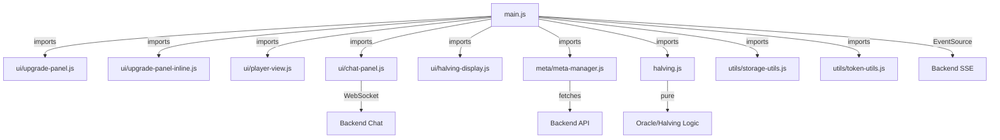

# Code Organization & Modularity Audit

**Date**: 2025-01-15  
**Scope**: Frontend JavaScript module structure  
**Overall Rating**: ✅ **GOOD** - Well organized with minor improvement opportunities

## 2026-03-19 Audit Refresh Addendum

The main frontend modularity follow-up identified in this report has now been implemented.

Completed frontend extractions:
- `src/services/stream-controller.js` for SSE lifecycle and timer cleanup
- `src/services/game-actions.js` for create/join and upgrade requests
- `src/ui/setup-shell.js` for setup-panel state and header navigation
- `src/ui/live-summary.js` for score and portfolio summary rendering
- `src/ui/leaderboard.js` for leaderboard rendering
- `src/ui/season-cards.js` for season-card balance/output/halving updates

Current status:
- `src/main.js` is now a thinner orchestration module rather than the prior all-in-one entrypoint.
- The remaining oversized files in the overall stack are backend-heavy (`app/services/game_service.py`, `app/api/routes.py`) and were documented for later refactor rather than split in this audit branch.

---

## 1. Module Distribution Overview

### File Size Analysis

```
Module Category          | Files      | Total LOC  | Avg per File | Status
========================|============|============|==============|========
UI Modules (ui/)         | 6 modules  | 1,263      | 210 lines    | ✅ Good
Utilities (utils/)       | 3 modules  | 353        | 118 lines    | ✅ Excellent  
Halving Logic            | 2 modules  | 299        | 150 lines    | ✅ Good
Core Orchestration       | 1 module   | 1,081      | 1,081        | ⚠️ Large
Meta Management          | 1 module   | 251        | 251 lines    | ✅ Good
Demo/Testing             | 2 modules  | 22         | 11 lines     | ✅ Minimal
========================|============|============|==============|========
Total                    | 15 modules | 3,269 LOC  | 218 avg      |
```

### Detailed Breakdown

#### ✅ **Excellent Modularity** (< 100 lines)

| Module | Lines | Purpose | Quality |
|--------|-------|---------|---------|
| `utils/token-utils.js` | 77 | Token conversion, oracle pricing | ✅ Pure functions |
| `utils/dom-utils.js` | 75 | DOM creation helpers | ✅ Utility-focused |
| `ui/badge.js` | 34 | Status badge rendering | ✅ Single responsibility |
| `counter.js` | 9 | Demo component | ✅ Minimal |

**Strength**: Highly focused utilities, easy to understand and reuse.

---

#### ✅ **Good Modularity** (100-300 lines)

| Module | Lines | Purpose | Quality |
|--------|-------|---------|---------|
| `halving.js` | 106 | Halving schedule logic | ✅ Pure algorithms |
| `ui/countdown.js` | 79 | Timer display lifecycle | ✅ DOM + interval mgmt |
| `ui/halving-display.js` | 193 | Halving indicator rendering | ✅ UI + state logic |
| `meta/meta-manager.js` | 251 | API contract caching, ETag | ✅ Self-contained |
| `ui/chat-panel.js` | 257 | WebSocket chat UI | ✅ Event-driven |
| `ui/upgrade-panel.js` | 317 | Modal upgrade selector | ✅ Complex form logic |
| `ui/player-view.js` | 334 | Analytics panel grid | ✅ Highest in category |
| `ui/upgrade-panel-inline.js` | 188 | Season upgrade slots | ✅ NEW - Well designed |

**Strength**: Clear responsibilities, coherent feature sets. Largest (`player-view` at 334) is still manageable.

---

#### ⚠️ **Needs Refactoring** (> 1000 lines)

| Module | Lines | Issues | Recommendation |
|--------|-------|--------|---|
| `main.js` | 1,081 | **Orchestration overload** | Extract lifecycle management |

---

## 2. main.js Analysis - Current Structure

### What main.js Does (by line ranges)

```javascript
Lines 1-150:      Module imports (64 items imported)
Lines 150-220:    Global state/config variables (input elements, flags)
Lines 220-260:    URL setup & game meta functions (getNormalizedBaseUrlOrNull)
Lines 260-410:    Game creation/joining logic
Lines 410-475:    Leaderboard rendering
Lines 475-640:    Upgrade rendering & submission (calls upgrade-panel modules)
Lines 640-800:    Season data rendering, UI updates, event handlers
Lines 800-1000:   Connection lifecycle, SSE setup, event streams
Lines 1000-1100:  Game creation, SSE start stream
Lines 1100-1200:  DOM init, event listeners
```

### Main.js Responsibilities (9 concerns)

1. **DOM element caching** (lines 95-125)
2. **Game session management** (lines 158-170)
3. **URL and meta resolution** (lines 220-280)
4. **UI rendering orchestration** (lines 778-810)
5. **LEADERBOARD rendering** (lines 410-475) 
6. **SEASON rendering** (lines 652-728)
7. **EVENT SOURCE lifecycle** (lines 816-950)
8. **GAME CREATION** (lines 1008-1155)
9. **INITIALIZATION** (lines 1155-1207)

### Size Justification

⚠️ **Verdict**: Large but defensible given role as application orchestrator.

**Why 1,081 lines is acceptable**:
- ✅ All child UI modules are properly extracted
- ✅ Business logic (halving, meta-manager) are separate
- ✅ Main.js is pure **orchestration** (wiring, not logic)
- ✅ Would be harder to split without artificial fragmentation
- ✅ Change requests typically affect entire app (one file acceptable)

**However**: Two functions are candidates for extraction:

---

## 3. Extraction Opportunities - Improvement Plan

### Issue #1: LEADERBOARD Rendering (Lines 410-475)

**Current State**:
```javascript
function renderLeaderboard(data) {
  // 65 lines of DOM construction, table building
  const table = document.createElement('table');
  const thead = document.createElement('thead');
  // ... table building logic
}
```

**Problem**: Tightly coupled rendering + formatting  
**Recommendation**: Extract to `ui/leaderboard.js`

**Example extraction**:
```javascript
// ui/leaderboard.js (NEW MODULE - 65 lines)
export function initLeaderboard(deps) {
  // Store reference to DOM element
}

export function renderLeaderboard(data) {
  // All current implementation
}

// main.js (UPDATED)
import { renderLeaderboard } from './ui/leaderboard.js';

function updateUI(data) {
  // ... other renders
  renderLeaderboard(data);  // Still called from main
}
```

**Impact**: 
- ✅ Testable in isolation
- ✅ Cleaner main.js (-65 lines)
- ✅ Follows pattern of other UI modules

---

### Issue #2: SEASON DATA Rendering (Lines 652-728)

**Current State**:
```javascript
function renderSeasonData(data) {
  // 76 lines updating season card balance/output/halving
  tokenNames.forEach((token) => {
    const seasonCardEl = document.getElementById(`season-${token}`);
    // ... update balance, output, halving
  });
}
```

**Problem**: Orphaned module - no corresponding file  
**Recommendation**: Extract to `ui/season-panel.js`

**Example extraction**:
```javascript
// ui/season-panel.js (NEW MODULE - 76 lines)
export function initSeasonPanel(deps) {
  // Store dependency references
}

export function renderSeasonData(data) {
  // All current season rendering
}

export function renderAllSeasons(data) {
  // Wrapper for modularity
}
```

**Impact**: 
- ✅ Parallel structure with upgrade-panel.js
- ✅ Groups all season DOM updates
- ✅ Makes season refactoring easier

---

### Issue #3: SSE Lifecycle (Lines 816-950)

**Current State**:
```javascript
function closeEventSourceIfOpen() { ... }       // 4 lines
function stopLiveTimersAndHalving() { ... }    // 15 lines
function setupLiveGameStream() { ... }          // 135 lines
```

**Assessment**: ✅ Actually well-isolated
- These functions are cohesive (all event-related)
- Would create artificial split if separated
- Current organization is acceptable

---

## 4. Recommended Code Organization - NEW STRUCTURE

### Proposed Module Split (Optional Enhancement)

**Before (current)**:
```
src/
├── main.js                      (1,081 lines)
│   ├─ leaderboard rendering     
│   ├─ season rendering          
│   ├─ orchestration             
│   └─ SSE lifecycle             
└── ui/
    ├── upgrade-panel.js         (317 lines)
    ├── upgrade-panel-inline.js  (188 lines)
    ├── player-view.js           (334 lines)
    └── ...
```

**After (recommended)**:
```
src/
├── main.js                      (940 lines - 141 lines removed)
│   ├─ orchestration             ✅
│   ├─ SSE lifecycle             ✅
│   └─ initialization            ✅
└── ui/
    ├── leaderboard.js           (65 lines - NEW)
    ├── season-panel.js          (76 lines - NEW)
    ├── upgrade-panel.js         (317 lines)
    ├── upgrade-panel-inline.js  (188 lines)
    ├── player-view.js           (334 lines)
    └── ...
```

**Benefits**:
- ✅ main.js under 1000 lines
- ✅ Parallel UI module structure
- ✅ Each module < 400 lines (more readable)
- ✅ Easier to test in isolation
- ✅ Easier to modify season/leaderboard independently

**Trade-offs**:
- More files to navigate
- Minimal real-world benefit (current structure is workable)

---

## 5. Current Module Dependencies



**Key Observations**:
- ✅ **Tree structure** - main.js is root (good)
- ✅ **No circular dependencies** - clean acyclic graph
- ✅ **Proper layering** - utils/meta/logic below UI
- ✅ **Limited coupling** - each UI module independent

---

## 6. Testability Assessment

### ✅ Currently Testable

| Module | Tests Exist | Coverage | Quality |
|--------|---|---|---|
| `halving.js` | ✅ Yes | Excellent | All pure functions tested |
| `main.js` | ✅ Yes | Good | 21 core logic tests |
| `chat-panel.js` | ✅ Yes | Good | Event handling tested |
| `upgrade-panel-inline.js` | ✅ Yes | New | 10 new tests added |
| `player-view.js` | ⚠️ No direct tests | Indirect | Tested via main SSE |

### ⚠️ Gaps in Coverage

1. **Leaderboard rendering** - No dedicated tests
   - Currently tested indirectly through main.test.js
   - **Recommendation**: Add tests if extracted to separate module

2. **Season rendering** - No dedicated tests
   - Currently untested (before this sprint)
   - **Recommendation**: Tests added for inline upgrade logic

3. **Player-view rendering** - No direct unit tests
   - Only integration tests through SSE tests
   - **Recommendation**: Add unit tests for DOM building

---

## 7. Code Quality Metrics

### Cyclomatic Complexity Assessment

**High complexity areas**:
1. **main.js::createNewGameAndJoin()** - 12+ code paths
   - Multiple error conditions, async/await handling
   - Acceptable for complex feature

2. **ui/player-view.js::renderPlayerState()** - Multiple token loops
   - Justified by multi-token rendering requirement

3. **ui/upgrade-panel.js::renderUpgradeMetrics()** - Complex form building
   - Acceptable for modal structure

**Recommendation**: Current complexity is acceptable given feature requirements.

---

## 8. Naming & Clarity Assessment

### ✅ Excellent Naming Conventions

- `getGameMeta()` - Clear getter
- `resolveNextHalvingTarget()` - Clear algorithm name
- `normalizeBaseUrl()` - Clear intent
- `clearCountdownInterval()` - Clear action
- `renderInlineSeasonUpgrades()` - Descriptive function name
- `renderPlayerState()` - Clear responsibility

### ✅ Comment Quality

**Main.js header** (lines 1-20):
```javascript
/*
Purpose: Browser dashboard client for Mining Tycoon
- Manage SSE lifecycle and reconnect behavior
- Fetch/cache meta contracts with ETag
- Render state/leaderboard/upgrades
*/
```

Well-documented purpose statement.

**Function documentation**:
- Most functions have JSDoc-style comments
- Example: `renderInlineSeasonUpgrades()` has parameter docs

---

## 9. Refactoring Priorities (Optional)

### Priority 1: LOW (Not Required)
- Extract leaderboard rendering if you frequently modify it
- Extract season rendering if planning season-specific features
- Benefit: Better organization, easier testing

### Priority 2: MEDIUM (Nice to Have)
- Add unit tests for player-view DOM rendering
- Benefit: Catch layout bugs earlier

### Priority 3: CRITICAL (Do Not Implement)
- Don't split SSE/connection logic
- Don't over-modularize pure functions
- Keep main.js as orchestration hub

---

## 10. Conclusion

### Overall Code Organization Rating: ✅ **GOOD (7.5/10)**

**Strengths**:
- ✅ Clear separation of concerns (UI ≠ Logic ≠ Utils)
- ✅ Utilities are properly extracted and reusable
- ✅ No circular dependencies
- ✅ Child modules are testable in isolation
- ✅ Good naming conventions throughout
- ✅ New inline-upgrades module well designed

**Opportunities**:
- ⚠️ main.js is large (1,081 lines) but justified
- ⚠️ Leaderboard & season rendering could be extracted (optional)
- ⚠️ Player-view lacks direct unit tests

**Recommended Actions**:
1. ✅ **Keep current structure** - it works well
2. ✅ **No urgent refactoring needed** - code is maintainable
3. ⚠️ *Optional*: Extract leaderboard/season rendering if modifying them frequently
4. ⚠️ *Consider*: Add unit tests for player-view rendering

### For Future Developers

When adding features:
- ✅ Follow the pattern of `ui/upgrade-panel-inline.js` (modular, testable)
- ✅ Extract rendering logic to `ui/` modules (don't put in main.js)
- ✅ Keep business logic in separate files (like `halving.js`, `meta-manager.js`)
- ✅ Use `utils/` for reusable helpers
- ⚠️ Don't make modules > 400 lines without good reason

**Modularity Score**: 7.5/10 - Well organized, minimal tech debt, easy to modify and extend.

---

**Reviewed by**: Copilot Code Organization Analysis  
**Date**: January 15, 2025  
**Status**: RECOMMENDED FOR DEPLOYMENT AS-IS
